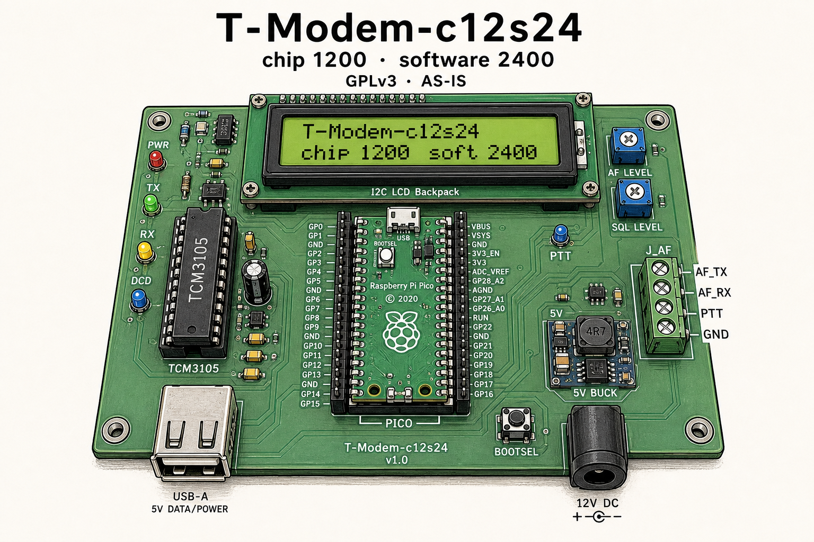

# T-Modem > USB-5V|12-Volt Terminal-Modem Reference
**Non-Profit for the Radio-World and easy to deploy/repair is parted by AI-Services** 
  

 

> **No firmware / no host software yet** — trees under `firmware/` and `software/` are placeholders only.  
> **Build a working hardware prototype first** (rails, assembly, bench checks).
> KiCad PCB is for **learning-by-doing** and small-run fab — run **DRC** and fix reported issues before ordering boards.  

**T-Modem** = **Terminal-Modem** — a real packet-radio modem board (registers + firmware) for host stacks such as MAX25-Stack.

**PHY mark:** **T-Modem-c12s24** — **c12** = chip **1200** (TCM3105-class AFSK) · **s24** = software **2400** (Pico firmware DSP later). One board; **no** second 2400 modem IC.

**Version:** **0.25** — hardware-only standard reference (**baseline** while building toward **v1.0**; software after the build) · [docs/HARDWARE-BASELINE.md](docs/HARDWARE-BASELINE.md)  
**License:** [GNU GPLv3](LICENSE)  
**Project intent:** non-profit / non-commercial community hardware project under GPLv3 (no separate legal entity claimed here).

**AS-IS — no support, no warranty:** This project and all materials are provided **as-is**. There is **no support** and **no warranty** of any kind. GPLv3 already disclaims warranty; this is also **project policy**.

**Scope:** T-Modem is a **standard reference only**. Custom product lines, per-customer variants, or commercial SKUs beyond that reference are **not** T-Modem — they are separate projects.

**Status/State:** The **v0.25** hardware design is **not** being redesigned. Develop it **as-is** to **v1.0** by **building** the board; **firmware / software come after** that. Change HW only if the build proves a blocking error.

Product docs and repo practice follow the operator publication standard (KISS, technical-right only, GPLv3 non-profit). This repository holds the complete product (hardware, firmware, shipped docs).

**Git branch:** you are on **`c12s24`** (active product tree). GitHub **`main`** is an index only — see [BRANCHES.md](BRANCHES.md).

---

## v0.25 release (this tag)

| Ships | Does not ship |
|-------|----------------|
| BOM with preferred commodity candidates + longevity notes | Firmware / host software |
| Fabricable netlist + KiCad project (190×110 mm TH PCB) | Fab-verified Gerbers without DRC pass |
| PCB outline + placement + assembly notes | Invented radio mic pinouts |
| Power · USB-A · green LCD · Pico UF2 · **TCM3105-class AFSK IF**
| **Hobby-friendly soldering** (sockets + through-hole) | Reflow / fine-pitch SMD as the default path |

See [docs/RELEASE-v0.25.md](docs/RELEASE-v0.25.md) · [docs/v0.25-VERIFICATION.md](docs/v0.25-VERIFICATION.md) · [docs/BOM.md](docs/BOM.md) · [docs/SCHEMATIC.md](docs/SCHEMATIC.md) · [docs/PCB-ASSEMBLY.md](docs/PCB-ASSEMBLY.md) · [hardware/](hardware/).

**Firmware / software:** placeholders only — [firmware/README.md](firmware/README.md) · [software/README.md](software/README.md).

---

## Hobby-friendly soldering

v0.25 is aimed at **hand soldering for anyone who can solder reasonably well** — not only professional reflow lines. Goal: **best value for money**, socketed, replaceable parts.

| Practice | Intent |
|----------|--------|
| **DIP / module sockets** | Modem IC in a **16-pin DIP socket**; Pico and LCD on **2.54 mm female sockets** |
| **Through-hole first** | Resistors, diodes, LEDs, trimmers, USB-A, barrel jack, screw terminals — **TH** (cheap commodity packs) |
| **Pre-made cheap modules** | Pico (~few €), green 16×2 LCD module, MP1584-class buck module — plug in, no fine-pitch MCU soldering |
| **I²C LCD level shift** | 5 V LCD1602 I²C backpack ↔ Pico 3.3 V: BSS138-class 4-ch module (**LV=3.3 V** · **HV=5 V** · GND common) — see [docs/BOM.md](docs/BOM.md) `U_LVL` |
| **Not required** | Stencil reflow, QFN/BGA, expensive milled sockets, or SOIC as the only modem package |

Assembly and cheap-part notes: [docs/PCB-ASSEMBLY.md](docs/PCB-ASSEMBLY.md) · [docs/BOM.md](docs/BOM.md) · [docs/ORDERING-BUDGET.md](docs/ORDERING-BUDGET.md).

---

## Role

| This repo | Elsewhere |
|-----------|-----------|
| Complete T-Modem **standard reference**: hardware, (future) firmware, BOM/PCB, shipped docs | MAX25-Stack: **thin plugin only** later (discover / talk; host keeps AX.25 / KISS) |
| Board owns modem PHY + register file + thin KISS bridge (when FW exists)

**Settled scope**

| Item | Fact |
|------|------|
| Form | Rectangle **190 × 110 mm** (v0.25 outline; §0.26 larger OK) |
| Modulation | AFSK **1200** (TCM3105-class) + **2400** (MCU DSP, FW later) |
| Host link | USB 2.0 **Type A receptacle** (toward PC); no active hub required |
| Power | **USB-only OK**; barrel **12 V** + buck **optional** (on reference); USB OR; optional active hub / **5 V** into USB/OR rail |
| Display | HD44780-class **16×2** character LCD, **green backlight** (preferred) |
| MCU | **Raspberry Pi Pico** (RP2040), preferably **Pico H** on socketed headers — ROM **UF2** field flash |
| Modem IC | **TCM3105**-class Bell-202 in **DIP + socket**
| Assembly | **Hobby-friendly:** sockets + through-hole; see section above |
| Field flash | Via the **USB Type-A** port to the PC (when FW exists) |
| Layer split | Host owns AX.25; board = modem + thin KISS |
| Radio equipment | Screw-terminal AF/PTT labels only — **no** invented mic pinouts |

---

## Build

| Step | v0.25 status |
|------|----------------|
| Schematic / netlist | **Documented** — [docs/SCHEMATIC.md](docs/SCHEMATIC.md) |
| KiCad project | **Present** — [hardware/kicad/t-modem/](hardware/kicad/t-modem/) (KiCad ≥8; regenerate via `scripts/generate_board.py`) |
| PCB outline / placement | **Documented** — [docs/PCB-ASSEMBLY.md](docs/PCB-ASSEMBLY.md) · [docs/PCB-LAYOUT.md](docs/PCB-LAYOUT.md) |
| BOM | **Candidates** — [docs/BOM.md](docs/BOM.md) · [hardware/bom/BOM.csv](hardware/bom/BOM.csv) |
| Verification | [docs/v0.25-VERIFICATION.md](docs/v0.25-VERIFICATION.md) |
| Firmware tree | **Placeholder only** |
| Fab | **DRC clean** → export Gerbers — see [hardware/fab/README.md](hardware/fab/README.md). Personal small-run OK — **AS-IS** |

---

## Operate

| Topic | Status |
|-------|--------|
| Host attach (USB CDC/ACM) | **TBD** until firmware |
| Register map / KISS | **TBD** — see [docs/OVERVIEW.md](docs/OVERVIEW.md) |
| Radio cable / pinout per model | **TBD** — expand from verified notes only |
| RX before live TX | Operator practice when RF path exists |

Site-private secrets belong in `./local/` (gitignored) — never commit passwords or host inventories.

---

## Documentation

| Doc | Content |
|-----|---------|
| [docs/README.md](docs/README.md) | Doc index |
| [docs/RELEASE-v0.25.md](docs/RELEASE-v0.25.md) | v0.25 hardware-only release note |
| [docs/v0.25-VERIFICATION.md](docs/v0.25-VERIFICATION.md) | Self-audit checklist |
| [docs/BOM.md](docs/BOM.md) | Bill of materials (candidates + sockets / TH hobby path) |
| [docs/ORDERING-BUDGET.md](docs/ORDERING-BUDGET.md) | Budget buy list — cheap, socketed, hand-solder |
| [docs/SCHEMATIC.md](docs/SCHEMATIC.md) | Fabricable netlist + block diagram |
| [docs/PCB-ASSEMBLY.md](docs/PCB-ASSEMBLY.md) | Outline, placement, hobby-friendly assembly |
| [docs/OVERVIEW.md](docs/OVERVIEW.md) | Settled product facts |
| [docs/HARDWARE-INTENT.md](docs/HARDWARE-INTENT.md) | Form, interfaces, radio intent |

Uncertain items are marked **TBD**. Do not treat TBD as verified capability.

---

## License and project intent

Copyright and distribution terms: **GNU General Public License v3** — see [LICENSE](LICENSE).

This is a **non-profit** open hardware / firmware project: share and change under GPLv3; not a commercial product pitch.

**AS-IS:** provided without support and without warranty of any kind (see notice at top of this README and GPLv3 §§15–16).
